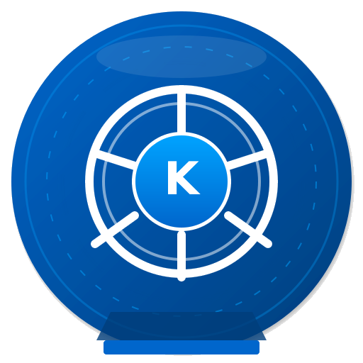

# KubeEngine

<div align="center">


### 构建于麒麟之上，为云原生时代打造的坚固基石

[](LICENSE)
[](http://www.kylinos.cn/)
[](https://www.python.org/)
[](https://fastapi.tiangolo.com/)

</div>

---

**KubeEngine** 是一个为 **Kylin Server V11** 操作系统深度优化的企业级容器云平台。我们致力于在国产化基础软硬件生态中，提供一套功能完备、稳定高效且高度自动化的 Kubernetes 发行版与管理解决方案。

## 目录

- [简介](#-简介)
- [核心特性](#-核心特性)
- [系统架构](#-系统架构)
- [快速开始](#-快速开始)
- [文档](#-文档)
- [开发指南](#-开发指南)
- [项目结构](#-项目结构)
- [技术栈](#-技术栈)
- [许可证](#-许可证)

## 📖 简介

KubeEngine 旨在简化在 Kylin OS 上构建和管理 Kubernetes 集群的复杂度。通过集成业界领先的开源工具与自研的自动化运维体系，我们为用户提供从基础设施部署、应用分发到可视化管理的一站式容器云体验。

**核心定位**：打造最适合 Kylin OS 的 Kubernetes 生态平台。

## ✨ 核心特性

### 🔩 自动化部署与运维
- **基于 pyinfra**：实现从裸机到完整 K8s 集群的全自动化、一键式部署
- **生产就绪组件**：预集成并自动化安装以下核心组件：
  - **Calico**：高性能容器网络解决方案
  - **MetalLB**：裸机 Kubernetes 的负载均衡器实现
  - **Longhorn**：云原生分布式块存储
  - **Harbor**：企业级 Docker 镜像仓库
  - **Kata Containers**：安全容器运行时
  - **Helm**：Kubernetes 应用包管理器
  - **Dashboard**：Kubernetes 通用 Web UI
  - **Metrics Server**：集群资源监控
  - **Nginx Ingress**：Kubernetes Ingress 控制器

### 🖥️ 统一可视化管控
- **自研 Web UI**：提供直观易用的图形化界面，告别复杂的命令行操作
- **强大的 API 引擎**：基于 FastAPI 构建的高性能 RESTful API
- **WebSocket 支持**：实时任务日志输出与状态更新
- **平台管理**：集群、节点、应用、资源的统一纳管与监控

### 📦 高效应用生命周期管理
- **应用模板中心**：内置经过抽象的通用应用模板（如 Redis）
- **一键部署**：支持通过 Helm Chart 快速部署各类中间件与应用
- **镜像工厂**：遵循 OCI 标准的自动化镜像构建系统
- **集群管理**：多集群支持，统一的集群纳管与操作

### 🔐 安全与认证
- **JWT 认证**：基于令牌的安全认证机制，支持 Token 刷新
- **AK/SK 密钥对**：API 访问密钥管理
- **TLS 证书管理**：自动化 CA 证书生成与管理
- **SSH 信任配置**：集群节点间 SSH 免密互信配置

### 🇨🇳 国产化生态支持
- 当前首发适配 **x86_64** 架构的 Kylin Server V11
- 路线图中规划对 **ARM64** 架构的适配

## 🏗️ 系统架构

```
┌─────────────────────────────────────────────────────────────────┐
│                         KubeEngine 平台                          │
├─────────────────────────────────────────────────────────────────┤
│  ┌─────────────┐  ┌─────────────┐  ┌─────────────────────────┐  │
│  │   Web UI    │  │  CLI 工具   │  │    RESTful API          │  │
│  │   (前端)    │  │  (命令行)   │  │    (FastAPI)            │  │
│  └──────┬──────┘  └──────┬──────┘  └───────────┬─────────────┘  │
│         │                │                     │                 │
│  ┌──────▼────────────────▼─────────────────────▼─────────────┐  │
│  │                    核心引擎层                               │  │
│  │  ┌─────────┐  ┌─────────┐  ┌─────────┐  ┌─────────────┐  │  │
│  │  │ 任务调度 │  │ SSH 管理 │  │ 配置管理 │  │ 镜像构建    │  │  │
│  │  └─────────┘  └─────────┘  └─────────┘  └─────────────┘  │  │
│  │  ┌─────────┐  ┌─────────┐  ┌─────────┐  ┌─────────────┐  │  │
│  │  │ 应用管理 │  │ ORM 存储 │  │ HTTP客户端│ │ WebSocket   │  │  │
│  │  └─────────┘  └─────────┘  └─────────┘  └─────────────┘  │  │
│  └──────────────────────────┬──────────────────────────────┘  │
├─────────────────────────────┼─────────────────────────────────┤
│                             │                                   │
│  ┌──────────────────────────▼──────────────────────────────┐  │
│  │                   Kubernetes 集群                        │  │
│  │  ┌──────────┐  ┌──────────┐  ┌──────────┐  ┌─────────┐  │  │
│  │  │  Master  │  │  Worker  │  │   Calico │  │ Longhorn│  │  │
│  │  │  节点    │  │  节点    │  │   网络   │  │  存储   │  │  │
│  │  └──────────┘  └──────────┘  └──────────┘  └─────────┘  │  │
│  │  ┌──────────┐  ┌──────────┐  ┌──────────┐  ┌─────────┐  │  │
│  │  │  Harbor  │  │ MetalLB  │  │ Dashboard│  │  Helm   │  │  │
│  │  │  镜像仓库│  │ 负载均衡 │  │  Web UI  │  │  包管理 │  │  │
│  │  └──────────┘  └──────────┘  └──────────┘  └─────────┘  │  │
│  └──────────────────────────────────────────────────────────┘  │
└─────────────────────────────────────────────────────────────────┘
```

## 🚀 快速开始

### 环境要求

- **操作系统**：Kylin Server V11 (x86_64)
- **Python**：3.11+
- **内存**：至少 8GB RAM
- **磁盘**：至少 50GB 可用空间

### 安装

```bash
# 克隆仓库
git clone https://github.com/kubengine/kubengine.git
cd kubengine

# 创建虚拟环境
python3.11 -m venv venv
source venv/bin/activate

# 安装依赖
pip install -e .
```

### 配置

编辑 `/opt/kubengine/config/application.yaml`：

```yaml
root_dir: /opt/kubengine
domain: kubengine.io

# 集群节点配置
cluster:
  nodes:
    - 172.31.57.23
    - 172.31.57.22
    - 172.31.57.21
  hostnames:
    172.31.57.23: kubengine3
    172.31.57.22: kubengine2
    172.31.57.21: kubengine1

# Kubernetes 配置
kubernetes:
  master:
    ip: 172.31.57.23
    schedulable: True
  worker:
    ips:
      - 172.31.57.22
      - 172.31.57.21
  cidr:
    pod: 10.96.0.0/16
    service: 10.97.0.0/16
  loadbalancer:
    ip-pools:
      - 172.31.57.30-172.31.57.40
```

### 初始化数据

```bash
# 初始化默认应用模板数据
python -m src.cli.app init-data
```

### 启动服务

```bash
# 启动 API 服务
python -m src.cli.app run --host 0.0.0.0 --port 8080
```

### Kubernetes 部署（使用 kubengine_k8s 命令）

kubengine_k8s 是专门用于 Kubernetes 部署的独立命令行工具：

```bash
# 查看帮助
kubengine_k8s --help

# 显示配置
kubengine_k8s config --show

# 部署 Kubernetes 集群
kubengine_k8s deploy --deploy-src /path/to/offline-files

# 详细输出日志
kubengine_k8s deploy --deploy-src /path/to/offline-files -vvv
```

### 默认账户

| 项目 | 值 |
|------|-----|
| 用户名 | `admin` |
| 默认密码 | `Admin@123` |
| AK（访问密钥 ID） | `AK8F60249C` |
| SK（密钥） | `SK17F1B276797F4957` |

> ⚠️ **安全警告**：生产环境请立即修改默认密码！

访问 `http://localhost:8080/docs` 查看 Swagger API 文档。

## 📚 文档

- **[CLI 命令文档](docs/CLI.md)** - 命令行工具完整使用指南
  - 原生 Python 执行方式
  - kubengine 命令方式
  - 应用管理、集群管理、镜像构建等命令

- **[配置说明](docs/CONFIGURATION.md)** - 配置文件详解
  - 配置文件位置和查找顺序
  - 完整配置项说明
  - 生产环境配置建议

- **[API 文档](docs/API.md)** - RESTful API 完整参考
  - 认证方式
  - 所有 API 端点详解
  - 使用示例

- **[RPM 打包](docs/RPM_BUILD.md)** - RPM 包构建指南

- **[PyPI 发布](docs/PYPI_INSTALL.md)** - PyPI 包发布指南

## 👨‍💻 开发指南

### 开发环境设置

```bash
# 安装开发依赖
pip install -e ".[dev]"

# 运行测试
pytest

# 代码格式化
black src/
isort src/

# 类型检查
mypy src/
```

### 代码风格

项目遵循以下代码规范：
- 使用 Python 3.10+ 类型注解（`str | None` 而非 `Optional[str]`）
- Google 风格的文档字符串
- 模块级分组注释（`# ============================ 标题 ============================`）
- 使用 `logger` 而非 `print` 进行日志输出

## 📚 文档

- **[CLI 命令文档](docs/CLI.md)** - 命令行工具完整使用指南
  - 原生 Python 执行方式
  - kubengine 命令方式
  - kubengine_k8s 命令方式
  - 应用管理、集群管理、镜像构建等命令

- **[配置说明](docs/CONFIGURATION.md)** - 配置文件详解
  - 配置文件位置和查找顺序
  - 完整配置项说明
  - 生产环境配置建议

- **[API 文档](docs/API.md)** - RESTful API 完整参考
  - 认证方式
  - 所有 API 端点详解
  - 使用示例

- **[RPM 打包](docs/RPM_BUILD.md)** - RPM 包构建指南

- **[PyPI 发布](docs/PYPI_INSTALL.md)** - PyPI 包发布指南

启动服务后可访问交互式 API 文档：
- **Swagger UI**：`http://localhost:8080/docs`
- **ReDoc**：`http://localhost:8080/redoc`

## 📁 项目结构

```
kubengine/
├── config/                    # 配置文件目录
│   ├── application.yaml       # 主配置文件
│   └── certs/                 # TLS 证书目录
│       ├── ca/                # CA 证书
│       └── server/            # 服务器证书
├── src/
│   ├── api/                   # RESTful API 实现（废弃，移至 web/api）
│   ├── builder/               # 镜像构建模块
│   │   └── image/
│   │       ├── base_builder.py      # 基础构建器类
│   │       ├── loader.py            # 构建器加载器
│   │       ├── os/                  # 操作系统镜像构建器
│   │       │   └── kylin_v11.py     # Kylin OS 构建器
│   │       ├── kubectl/             # kubectl 镜像
│   │       ├── redis/               # Redis 镜像
│   │       └── rootfs/              # 根文件系统构建器
│   ├── cli/                   # 命令行工具
│   │   ├── app.py             # 应用管理命令
│   │   ├── cluster.py         # 集群管理命令
│   │   ├── image.py           # 镜像构建命令
│   │   ├── k8s.py             # K8s 部署命令
│   │   └── models.py          # CLI 模型
│   ├── core/                  # 核心功能模块
│   │   ├── config/            # 配置管理
│   │   │   ├── application.py
│   │   │   ├── config_dict.py
│   │   │   └── inject.py
│   │   ├── containerd/        # Container 运行时
│   │   ├── http_api_client/   # HTTP API 客户端
│   │   │   ├── basic_client.py
│   │   │   ├── dashboard_client.py
│   │   │   ├── harbor_client.py
│   │   │   ├── helm_resource_check.py
│   │   │   ├── k8s_client.py
│   │   │   └── longhorn_client.py
│   │   ├── misc/              # 工具模块
│   │   │   ├── ca.py
│   │   │   ├── network.py
│   │   │   ├── password.py
│   │   │   ├── properties.py
│   │   │   ├── time.py
│   │   │   └── websocket.py
│   │   ├── orm/               # 数据模型
│   │   │   ├── app.py
│   │   │   ├── app_field_config.py
│   │   │   ├── cluster.py
│   │   │   ├── engine.py
│   │   │   └── task.py
│   │   ├── command.py         # 命令执行
│   │   ├── logger.py          # 日志系统
│   │   └── ssh.py             # SSH 客户端
│   ├── infra/                 # 基础设施部署脚本
│   │   ├── install_calico.py          # Calico 网络
│   │   ├── install_containerd.py      # Container 运行时
│   │   ├── install_cni.py             # CNI 网络
│   │   ├── install_dashboard.py       # K8s Dashboard
│   │   ├── install_harbor.py          # 镜像仓库
│   │   ├── install_helm.py            # 包管理器
│   │   ├── install_ingress_nginx.py   # Ingress 控制器
│   │   ├── install_kubernetes.py      # K8s 组件
│   │   ├── install_longhorn.py        # 分布式存储
│   │   ├── install_metallb.py         # 负载均衡器
│   │   ├── install_metrics_server.py   # 指标采集
│   │   ├── issue_cert.py              # 证书生成
│   │   ├── kubernetes_join_node.py    # 节点加入
│   │   └── executor_wrapper.py        # 脚本执行器
│   └── web/                   # Web 界面
│       ├── api/               # API 端点
│       │   ├── app.py         # 应用管理 API
│       │   ├── artifacts.py   # 制品管理 API
│       │   ├── auth_routes.py # 认证 API
│       │   ├── health.py      # 健康检查 API
│       │   ├── k8s.py         # K8s 管理 API
│       │   ├── ssh.py         # SSH 管理 API
│       │   └── websocket.py   # WebSocket API
│       ├── main.py            # FastAPI 应用入口
│       ├── static/            # 静态文件
│       └── utils/             # Web 工具
│           ├── auth.py        # 认证工具
│           ├── page.py        # 分页工具
│           └── response.py    # 响应工具
├── static/                    # 静态资源
│   ├── badge/                 # 徽章图片
│   └── logo.png               # Logo 图片
├── logs/                      # 日志文件目录
├── tests/                     # 测试文件
├── pyproject.toml             # 项目配置
├── kubengine.db               # SQLite 数据库
└── README.md                  # 项目文档
```

## 🛠️ 技术栈

### 后端框架
- **FastAPI** >= 0.121.3：现代化、高性能的 Web 框架
- **Uvicorn** >= 0.38.0：ASGI 服务器
- **Pydantic** v2：数据验证与设置管理
- **SQLAlchemy** >= 2.0.45：ORM 工具
- **Click**：命令行界面框架

### Kubernetes 生态
- **kubernetes-python** >= 34.1.0：Kubernetes Python 客户端
- **Helm**：Kubernetes 包管理器
- **pyinfra** >= 3.5.1：自动化基础设施部署
- **asyncssh** >= 2.21.1：异步 SSH 客户端

### Web 与通信
- **WebSockets** >= 15.0.1：实时通信
- **python-multipart** >= 0.0.20：文件上传支持
- **requests** >= 2.32.5：HTTP 请求库

### 开发工具
- **pytest** >= 9.0.1：测试框架
- **black** >= 23.1.0：代码格式化
- **mypy** >= 1.0.0：静态类型检查
- **isort** >= 5.12.0：导入排序
- **rich** >= 14.3.1：美化命令行输出

## 📄 许可证

本项目采用 [Apache License 2.0](LICENSE) 开源协议。

## 🤝 贡献

欢迎贡献代码！请查看 [CONTRIBUTING.md](CONTRIBUTING.md) 了解详情。

## 📮 联系方式

- **作者**：duanzt
- **邮箱**：duanziteng@gmail.com
- **项目主页**：https://github.com/kubengine/kubengine
